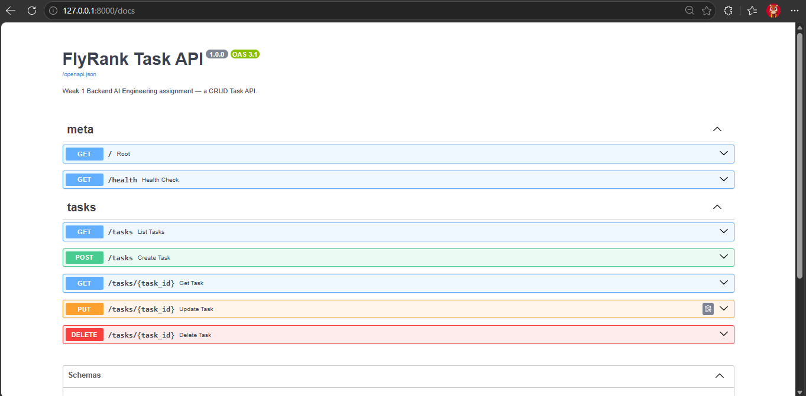

# Task API — Build your first CRUD API

Week 2 assignment (BE-01) for the **Backend AI Engineering** track at FlyRank.

A CRUD API that manages a to-do list — create, read, update, and delete tasks — tested via Swagger UI and published on GitHub.

## Stack

- **FastAPI** — Python web framework, auto-generates OpenAPI docs
- **Pydantic v2** — request/response validation
- **pytest + httpx** — test suite

## Run it

```bash
pip install -r requirements.txt
uvicorn app.main:app --reload
```

API: http://127.0.0.1:8000  
Interactive docs (Swagger UI): http://127.0.0.1:8000/docs

## Endpoints

| Method | Path            | Status codes                          |
|--------|-----------------|---------------------------------------|
| GET    | `/`             | 200 — API metadata                    |
| GET    | `/health`       | 200 — liveness check                  |
| POST   | `/tasks`        | 201 Created, 400 Bad Request          |
| GET    | `/tasks`        | 200 OK                                |
| GET    | `/tasks/{id}`   | 200 OK, 404 Not Found                 |
| PUT    | `/tasks/{id}`   | 200 OK, 400 Bad Request, 404 Not Found|
| DELETE | `/tasks/{id}`   | 204 No Content, 404 Not Found         |

## curl example

```
$ curl -i http://127.0.0.1:8000/
HTTP/1.1 200 OK
date: Wed, 15 Jul 2026 12:56:26 GMT
server: uvicorn
content-length: 54
content-type: application/json

{"name":"Task API","version":"1.0","endpoints":["/tasks"]}
```

```
$ curl -i http://127.0.0.1:8000/tasks/99
HTTP/1.1 404 Not Found
date: Wed, 15 Jul 2026 12:56:26 GMT
server: uvicorn
content-length: 64
content-type: application/json

{"error":"task_not_found","message":"Task with id 99 was not found."}
```

```
$ curl -i -X POST http://127.0.0.1:8000/tasks -H "Content-Type: application/json" -d "{\"title\":\"Buy milk\"}"
HTTP/1.1 201 Created
date: Wed, 15 Jul 2026 12:56:26 GMT
server: uvicorn
content-length: 109
content-type: application/json

{"id":4,"title":"Buy milk","description":null,"completed":false,"created_at":"...","updated_at":"..."}
```

```
$ curl -i -X POST http://127.0.0.1:8000/tasks -H "Content-Type: application/json" -d "{}"
HTTP/1.1 400 Bad Request
date: Wed, 15 Jul 2026 12:56:26 GMT
server: uvicorn
content-length: 74
content-type: application/json

{"error":"validation_error","message":"Title is required and must not be empty."}
```

## Swagger UI



Open http://127.0.0.1:8000/docs after starting the server to interact with the API visually.

## Project structure

```
+-- app/
¦   +-- main.py          # FastAPI app, routes, error handlers
¦   +-- models.py        # Pydantic schemas (request/response shapes)
¦   +-- repository.py    # In-memory data layer
¦   +-- exceptions.py    # Domain exceptions (framework-agnostic)
+-- tests/
¦   +-- test_tasks.py    # 13 tests covering CRUD + error paths
+-- requirements.txt
```

## Tests

```bash
pytest -v
```

13 tests: root endpoint, health check, full CRUD flow, missing/empty title (400), not-found errors (404), correct status codes on every endpoint.


